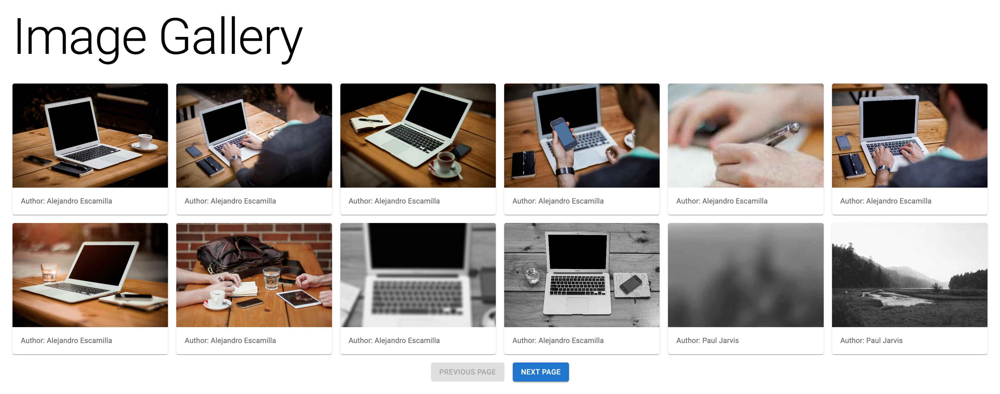
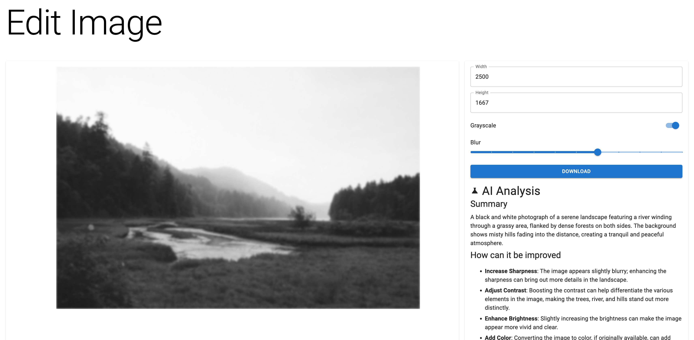

# AssistedCreationTool

✨ **This workspace has been generated by [Nx, Smart Monorepos · Fast CI.](https://nx.dev)** ✨

## Getting Started

`yarn install`

## Features

### List with pagination

### Edit page

### AI summary for people with disabilities

Imagine a user with a visual disability who can rely on an advanced AI assistant to describe the contents of an image and offer personalized recommendations.
Picture a groundbreaking RAG (Retrieval-Augmented Generation) application that not only interprets and edits images but also opens up a world of possibilities for individuals with disabilities.
This innovation promises to revolutionize accessibility, providing unparalleled support and empowerment. The fusion of cutting-edge AI and thoughtful design stands to break barriers and enhance independence, showcasing the transformative potential of technology in creating an inclusive future.

## Start the FE application

Run `yarn nx serve assisted_creation_tool` to start the development server. Happy coding!

## Start the API for ai summary feature

Run `yarn nx serve ai-api` to start the development server. Happy coding!

- I hardcoded my OpenAI key for the demo, I have some free credits there

## Explore the project graph

Run `npx nx graph` to show the graph of the workspace.
It will show tasks that you can run with Nx.

- [Learn more about Exploring the Project Graph](https://nx.dev/core-features/explore-graph)

## Integrate with editors

Enhance your Nx experience by installing [Nx Console](https://nx.dev/nx-console) for your favorite editor. Nx Console
provides an interactive UI to view your projects, run tasks, generate code, and more! Available for VSCode, IntelliJ and
comes with a LSP for Vim users.
